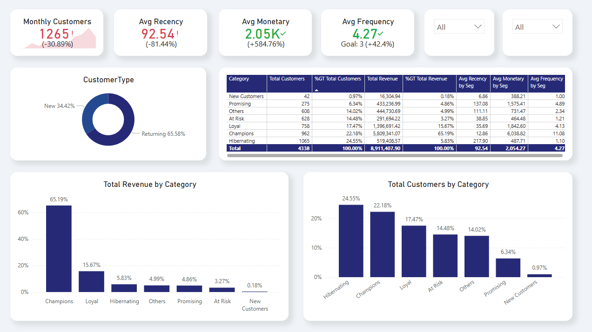

# 🛒 Online Retail E-commerce Analytics

End-to-end pipeline to clean, analyze, and segment 500 K+ UK online retail transactions using Python, SQL, and Power BI—showcasing real-world data expertise without a formal degree.


## 📋 Table of Contents

1. [Project Overview](#project-overview)  
2. [Dataset](#dataset)  
3. [Project Structure](#project-structure)
4. [Environment & Setup](#environment--setup)  
5. [Notebook Workflows](#notebook-workflows)  
6. [Supplementary Analysis](#supplementary-analysis)  
7. [Interactive Dashboard](#interactive-dashboard)  
8. [Key Insights & Actions](#key-insights--actions)  
9. [PDF & Screenshot](#pdf--screenshot)  
10. [Contributing & Contact](#contributing--contact)  
11. [License](#license)  

---

## Project Overview

Simulate the role of a business analyst for a UK e-commerce retailer by:

- **Cleaning & Preparing** 500 K+ raw transactions for reliable analysis  
- **Exploring** key sales patterns (monthly trends, top products, country breakdown)  
- **Segmenting Customers** with RFM (Champions, Loyal, At Risk, etc.)  
- **Building** an interactive Power BI dashboard with dynamic filters  
- **Delivering** 5 actionable insights to guide targeted marketing and ROI  

---

## Dataset

- **Source:** UCI Machine Learning Repository – [Online Retail](https://archive.ics.uci.edu/ml/datasets/Online+Retail)  
- **Period:** Dec 2010 to Dec 2011 (1 year)  
- **Records:** ~541 909 transactions  
- **Fields:**
  - `InvoiceNo` (string): transaction ID; “C” prefix = cancellation  
  - `StockCode` (string): product code  
  - `Description` (string): product name  
  - `Quantity` (integer): units sold  
  - `InvoiceDate` (datetime): timestamp  
  - `UnitPrice` (float): price per unit (GBP)  
  - `CustomerID` (integer): unique customer  
  - `Country` (string): customer location
  
## Project Structure

   ```text
ecommerce-customer-analytics/
├─ data/
│  ├─ raw/                   # original Excel download
│  └─ processed/             # cleaned_retail.csv, rfm_segments.csv
├─ notebooks/
│  ├─ 01_eda.ipynb           # cleaning & EDA → cleaned_retail.csv
│  └─ 02_rfm_segmentation.ipynb  # RFM scoring → rfm_segments.csv
├─ sql/
│  ├─ analysis.sql           # ad-hoc exploration queries
│  └─ outputs/               # CSV exports of each query
├─ excel/
│  └─ sql_dashboard.xlsx     # pivot tables & Pareto charts
├─ dashboards/
│  └─ ecom_rfm_report.pbix   # Power BI report file
├─ docs/
│  ├─ Customers_RFM.png      # example screenshot
│  ├─ dashboard_preview.png  # full report PDF
│  └─ dashboard.pdf          # full report PDF
├─ requirements.txt          # Python dependencies for notebooks
└─ README.md                 # this file
   ```

## Environment & Setup

1. **Clone the repo**  
   ```bash
   git clone https://github.com/josephuyana/ecommerce-customer-analytics.git
   cd ecommerce-customer-analytics
   ```
2. **Create & activate a virtual environment**  
   ```bash
   python3 -m venv .venv
   source .venv/bin/activate  
   ```
3. **Install Python dependencies**
   ```bash
   pip install -r requirements.txt
   ```

## Notebook Workflows

1. **01_eda.ipynb**  
   - Load raw Excel → drop cancellations & nulls → compute `TotalPrice`  
   - EDA: monthly trends, top products, country revenue  
   - → exports `data/processed/cleaned_retail.csv`

2. **02_rfm_segmentation.ipynb**  
   - Load `cleaned_retail.csv` → calculate Recency, Frequency, Monetary  
   - Assign quintile scores & business-friendly segments  
   - → exports `data/processed/rfm_segments.csv`

## Supplementary Analysis

- **SQL queries**:  
  All ad-hoc exploration and aggregation lives in `sql/analysis.sql`, with each query’s CSV export in `sql/outputs/` (e.g. `top_products.csv`, `monthly_revenue.csv`).

- **Excel pivots & charts**:  
  Early KPI prototypes (Pareto, pivot tables by month/country) are in `excel/pivot_charts.xlsx`, demonstrating comfort with traditional BI tools.

## Interactive Dashboard

- **Live Preview:**  
  [](https://app.powerbi.com/view?r=eyJrIjoiYWQzZTJjNWUtMTZiNy00ZDk4LWE2MTUtMjQ1ZDQ5ZDc5NWUzIiwidCI6ImQ2NDM4MDgyLWViOTgtNGMzZi04Mzk3LTVkYmRmZTQwMzZmZCIsImMiOjR9)

- **Power BI Desktop (free):**  
  1. Download & install from Microsoft.  
  2. File → Open → `dashboards/ecom_rfm_report.pbix`

## Key Insights & Actions

- **Champions (22.2 %) → 65.2 % of revenue**  
  Action: Launch VIP loyalty perks (exclusive discounts, double points).

- **Hibernating (24.6 %) → 5.8 % of revenue**  
  Action: Send win-back emails with time-limited offers.

- **Promising (6.3 %) → 4.9 orders avg, last purchase 137 days ago**  
  Action: Run “We miss you” campaign with personalized product suggestions.

- **At Risk (14.5 %) → 3.3 % of revenue, 1.2 orders avg**  
  Action: Offer cross-sell bundles and reward points within 30 days.

- **New Customers (0.97 %) → £388 avg spend, last purchase 7 days ago**  
  Action: Start a 3-step onboarding drip (welcome → tutorial → recommendations).

## PDF & Screenshot

- 📄 [Download full dashboard (PDF)](docs/dashboard.pdf)  
- 

## Contributing & Contact

Contributions, feedback and bug reports are welcome:

1. Fork this repo  
2. Create a feature branch (`git checkout -b feature-name`)  
3. Commit your changes (`git commit -m "Add feature"`)  
4. Push to your branch (`git push origin feature-name`)  
5. Open a Pull Request

**Contact:**  
Joseph Uyana • [LinkedIn](https://www.linkedin.com/in/uyanajoseph/) • uyanajoseph@gmail.com  

## License

This project is licensed under the [MIT License](LICENSE).  

